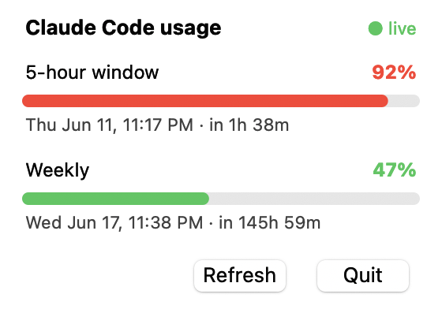

# ratebar

macOS menu bar readout of Claude Code subscription usage. A small ring gauge in
the menu bar shows the worst of your two windows; click it for a native popover
with colored progress bars and reset times.

- Menu bar: a severity-colored **ring gauge** + the worst-window percentage
  (`~` prefix when on the estimate fallback).
- Popover: **5-hour** and **weekly** windows, each a colored progress bar, a
  percentage, and the reset **date + time + countdown**. Auto-adapts to
  light/dark mode.
- **Live** official percentages via the Claude Code OAuth token when reachable.
- **Estimate** from local `~/.claude` token logs as fallback.

## Run (from source)

    uv run python -m ratebar

## Install (.app / .dmg)

Build a standalone menu-bar app — no Python needed to run it:

    packaging/build_dmg.sh

This produces `packaging/dist/ratebar.app` and `packaging/dist/ratebar.dmg`
(arm64, menu-bar-only via `LSUIElement`). Open the `.dmg` and drag **ratebar**
to Applications.

The build is **unsigned / not notarized**, so Gatekeeper will block it on first
launch. To open it: right-click `ratebar.app` → **Open** → **Open**, once. After
that it launches normally. To start it at login: System Settings → General →
Login Items → add ratebar.

## Tune the estimate

Edit `Budget` defaults in `src/ratebar/types.py` to match your plan's limits.

## How it works

Four small modules:

- `fetcher_live.py` — calls the official `/usage` endpoint with your OAuth token.
- `fetcher_logs.py` — estimates usage by summing tokens from local JSONL logs.
- `usage.py` — tries live first, falls back to the estimate, never crashes.
- `app.py` — native pyobjc menu bar: `NSStatusItem` ring (`gauge.py`) + an
  `NSPopover` (`ui/popover.py`, `ui/bar_view.py`); `render.py` does the math.

## Note

The live `/usage` endpoint (`/api/oauth/usage`) is undocumented but verified
against Claude Code 2.1.173. If Anthropic changes it, ratebar silently falls
back to the estimate (shown with a `~` prefix). See `src/ratebar/fetcher_live.py`.
